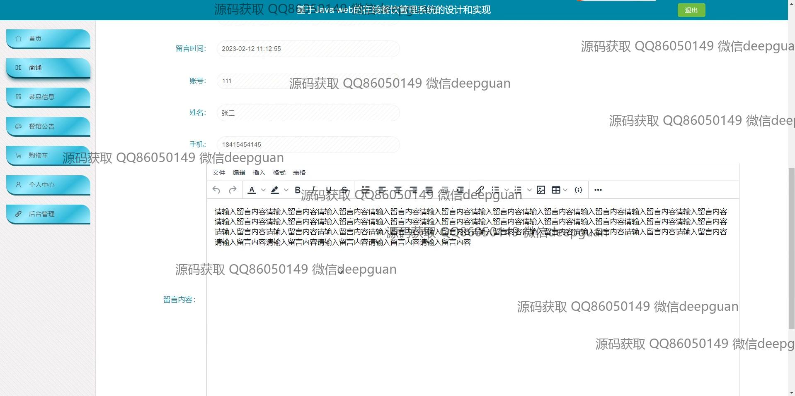
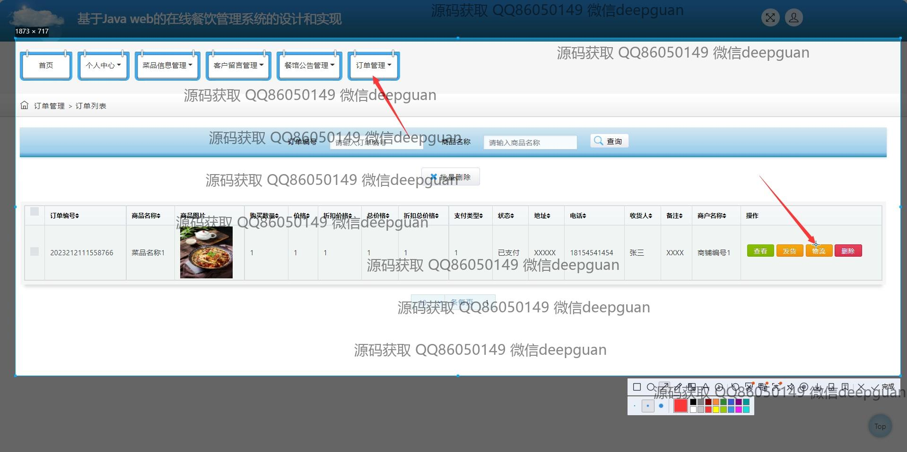

<h1 align="center">基于Java web的在线餐饮管理系统的设计和实现</h1>

## 简介
在线餐饮管理系统：角色分为管理员、用户、商铺；包括用户注册、登录、多角色管理、订单管理、菜品信息管理、公告编辑、个人信息管理、充值和商品推荐等功能。    --计算机毕业设计源码；毕设源码；java毕业设计源码

## 联系方式

<h3 align="center">获取完整代码与数据库文件 + 微信：deepguan QQ: 86050149 QQ群: 783742310</h3>

<h3 align="center">可帮忙远程部署 包运行成功！提供远程部署、修改代码、设计文档指导、代码讲解等服务！</h3>

## 功能介绍（完整见运行截图）
管理员：基本功能包括登录、注册和退出系统操作。可以通过系统管理菜品信息、编辑公告、管理用户留言及个人订单。支持查看用户信息、餐馆信息及公告发布功能，管理导航栏中所有界面模块。系统允许管理员对订单进行查看、确认收货、退货和评价等操作。界面简洁清晰，便于管理员高效管理系统内各项事务。

用户：支持基本的登录、注册和退出功能。用户可以通过导航栏快速访问不同功能模块，如首页、商铺、菜品信息、公告和购物车等，方便查看及选择心仪菜品。用户中心允许查看及修改个人信息、账户余额及充值操作。能够添加菜品至购物车、完成订单支付、查看订单详情以及物流状态，保障用户的操作简便与体验满意。提供收藏及评价功能，进一步提升交互体验。

## 运行截图

本代码来源于网络,仅供学习参考使用!

